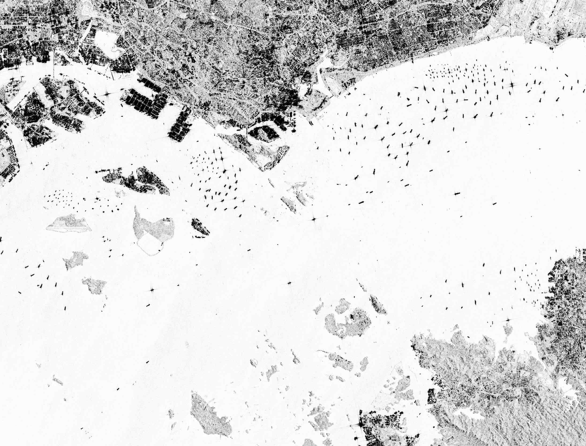

# Boat Detection using GDAL and Sentinel-1 SAR Data

Sentinel-1 sample data of Singapore, courtesy of [Copernicus](https://browser.dataspace.copernicus.eu/):



## Purpose

This project is a small PoC that uses GDAL to detect boats in Sentinel-1 SAR imagery.

## Scope

The original idea included drift tracking, but Copernicus Sentinel-1 revisit frequency is not high enough in most areas for reliable tracking. This README and codebase focus on **single-scene boat detection**.

## Sample Data

The `data/` folder contains sample GeoTIFF files covering the maritime area between Singapore and Indonesia:

- `2017-01-22-00_00_2017-01-22-23_59_Sentinel-1_IW_VV_VV_(Raw).tiff`
- `2017-02-15-00_00_2017-02-15-23_59_Sentinel-1_IW_VV_VV_(Raw).tiff`

These are Sentinel-1 IW (Interferometric Wide Swath) mode images in VV polarization, capturing backscatter intensity data that reveals vessels on the water surface.

### How the sample data was obtained (Copernicus Browser)

The sample scenes were downloaded from [Copernicus Browser](https://browser.dataspace.copernicus.eu/) using the following search filters:

- **Mission**: Sentinel-1
- **Product Type**: GRD
- **Mode**: IW
- **Polarisation**: VV

Typical download flow:
1. Open Copernicus Browser and zoom to the area of interest (Singapore–Indonesia waters in this PoC).
2. Set the date range for the acquisition window you want.
3. In dataset filters, select `Sentinel-1` mission, then `GRD`, `IW`, and `VV`.
4. Choose scenes with good sea coverage and minimal land clutter for the target area.
5. Download the product (GeoTIFF/measurement raster as provided by the platform workflow) and place it in `data/`.

### Why these criteria matter

- **Sentinel-1**: SAR is all-weather, day/night capable, so vessel signatures are available even with cloud cover where optical imagery fails.
- **GRD (Ground Range Detected)**: Provides detected intensity imagery that is straightforward for thresholding and connected-component detection (the core approach in this project).
- **IW (Interferometric Wide Swath)**: Offers broad coastal/offshore coverage at suitable spatial resolution, making it practical for scanning maritime scenes for vessel candidates.
- **VV polarisation**: Produces consistent sea-surface backscatter behavior for this pipeline and is commonly available, helping stable threshold-based detection tuning.

## Requirements

Before running this tool, ensure you have:

- **Docker**: Docker must be installed and running on your system
  - **macOS**: [Docker Desktop](https://www.docker.com/products/docker-desktop)
  - **Linux**: `sudo apt install docker.io` (Ubuntu/Debian) or equivalent
  - **Windows**: [Docker Desktop](https://www.docker.com/products/docker-desktop)
- **Go 1.25+**: To compile the tool (optional if using pre-built binaries)

**No local GDAL installation required** – the tool uses a Docker container with GDAL pre-installed.

## Docker Requirements Check

Before running, verify Docker is available:

```bash
# Check Docker is running
docker ps

# Pull GDAL image manually (optional - tool does this automatically)
docker pull ghcr.io/osgeo/gdal:latest
```

On first run, the tool will automatically:
1. Verify Docker is available
2. Check if the GDAL image is present
3. Pull the image if needed (~500MB, one-time download)

## How to Compile

```bash
# Navigate to the project directory
cd boatdetect

# Build the binary
go build ./cmd/boatdetect

# Verify the build
./boatdetect --help
```

The compiled binary will be named `boatdetect` in the current directory.

## How to Use

```bash
./boatdetect --input ./data --out ./detections.geojson
```

### Expected Output

After running the command, the tool prints a per-scene summary table in the CLI and writes detections to a GeoJSON file.

Example CLI output:
```bash
ryanchung@Ryans-MBP boatdetect % ./boatdetect --input ./data --out detections.geojson
scene_id                                                     candidates  score_mean  score_max  area_min  area_max
2017-01-22-00_00_2017-01-22-23_59_Sentinel-1_IW_VV_VV_(Raw)  103         0.00        0.00       15        4530216
2017-02-15-00_00_2017-02-15-23_59_Sentinel-1_IW_VV_VV_(Raw)  97          0.00        0.00       15        4546495
```

The GeoJSON output contains detected boat candidates. Each detection includes:
- **Longitude and Latitude**: Geographic coordinates of the detected object
- **Score**: Detection confidence score (based on pixel intensity)
- **Area (pixels)**: Size of the detected object in pixels
- **Scene ID**: Source image identifier

Example output (detections.geojson):
```json
{
  "type": "FeatureCollection",
  "features": [
    {
      "type": "Feature",
      "geometry": {
        "type": "Point",
        "coordinates": [103.69940242370556, 1.2749803888071236]
      },
      "properties": {
        "area_px": 701,
        "scene_id": "2017-01-22-00_00_2017-01-22-23_59_Sentinel-1_IW_VV_VV_(Raw)",
        "score": 0
      }
    }
    ...
  ]
}
```

## What the Tool Does

The boat detection pipeline consists of several steps, leveraging GDAL for geospatial data processing:

### 1. **Input Discovery**
   - Scans the input directory for `.tif` or `.tiff` files
   - Determines the geographic bounding box covering all input files

### 2. **Preprocessing with GDAL**
   The tool uses GDAL commands running in Docker containers to prepare the data:
   
   **a. Coordinate Transformation (`gdalwarp`)**
   - Reprojects the input raster to EPSG:4326 (WGS84 lat/lon)
   - Crops to the computed bounding box
   - Uses bilinear resampling for smooth output
   
   ```bash
   gdalwarp -t_srs EPSG:4326 \
            -te <minLon> <minLat> <maxLon> <maxLat> \
            -r bilinear \
            input.tif output_tmp.tif
   ```
   
   **b. Byte Scaling (`gdal_translate`)**
   - Converts pixel values to 8-bit (0-255 range)
   - Applies automatic scaling based on data range
   
   ```bash
   gdal_translate -ot Byte -scale tmp.tif output_byte.tif
   ```

### 3. **Grid Conversion (`gdal_translate` to AAIGrid)**
   - Converts the GeoTIFF to ASCII Grid format (AAIGrid)
   - This format is easier to parse for pixel-by-pixel analysis
   
   ```bash
   gdal_translate -of AAIGrid byte.tif output.asc
   ```

### 4. **Statistical Analysis**
   - Parses the ASCII grid into memory
  - Computes detection thresholds (see **Algorithm Details** for threshold behavior and parameters)

### 5. **Connected Component Analysis**
   - Applies thresholding to create a binary mask (boat vs. background)
   - Performs flood-fill to identify connected pixel regions
   - Filters out small components (noise) based on minimum area (2 pixels by default)

### 6. **Candidate Extraction**
   - For each connected component:
     - Computes the centroid in pixel coordinates
     - Converts pixel coordinates to geographic coordinates (lon/lat) using the GeoTransform
     - Calculates a confidence score based on average pixel intensity
     - Records the component area in pixels

### 7. **Output Generation**
   - Limits the number of candidates to the top 200 (configurable) by area
   - Groups candidates by source scene
  - Writes the CLI summary table and GeoJSON output

### 8. **Cleanup**
   - Removes temporary preprocessing files

## Algorithm Details

The detection algorithm is designed for **dark targets on bright backgrounds**, which is typical for vessels on SAR imagery where:
- Water appears bright (high backscatter)
- Vessels appear dark (low backscatter) due to shadow effects

### Key Parameters

| Parameter | Default | Description |
|-----------|---------|-------------|
| `k` | 2.0 | Standard deviation multiplier for threshold |
| `percentile` | 99.5 | Percentile for statistical thresholding |
| `invert` | true | Detect dark pixels (below threshold) |
| `minAreaPx` | 2 | Minimum component size in pixels |
| `maxCandidates` | 200 | Maximum number of detections to output |

### Detection Thresholds

- **Inverted mode** (default): Detects pixels with values below `mean - k×std` or below the (100 - percentile)th percentile
- **Normal mode**: Detects pixels above `mean + k×std` or above the percentile

## Docker Integration

The tool runs GDAL inside ephemeral Docker containers. The first run ensures `ghcr.io/osgeo/gdal:latest` is available, mounts the working directory to `/work`, executes GDAL commands, then cleans up containers.

### Architecture

```
User runs: ./boatdetect --input data --out detections.geojson
     ↓
Main program initializes Docker client
     ↓
For each TIFF file:
  ├─ Run gdalwarp in Docker container
  ├─ Run gdal_translate in Docker container
  ├─ Run gdal_translate (AAIGrid) in Docker container
  └─ Process detections locally
     ↓
Output GeoJSON file
```

## Project Structure

```
boatdetect/
├── boatdetect              # Compiled binary
├── cmd/
│   └── boatdetect/         # Main application entry point
│       ├── main.go         # Program initialization
│       └── detect.go       # Detection command logic
├── internal/
│   ├── detect/             # Detection algorithm
│   │   ├── pipeline.go     # Main detection pipeline
│   │   ├── components.go   # Connected component analysis
│   │   ├── geo.go          # Coordinate transformations
│   │   └── stats.go        # Statistical computations
│   ├── gdal/               # GDAL wrapper
│   │   ├── docker.go       # Docker-based GDAL execution
│   │   ├── preprocess.go   # Image preprocessing
│   │   ├── info.go         # Raster metadata extraction
│   │   └── aai.go          # AAIGrid parser
│   ├── docker/             # Docker client
│   │   └── client.go       # Docker container management
│   └── geojson/            # GeoJSON output
│       └── boats.go        # Feature collection builder
├── data/                   # Sample Sentinel-1 data
└── detections.geojson      # Example output
```

## Testing

The project includes comprehensive unit tests for all major components:

```bash
# Run all tests
go test ./...

# Run tests with coverage
go test -cover ./...

# Run specific package tests
go test ./internal/detect
go test ./internal/gdal
```

## Troubleshooting

### Docker Not Running

```
Error: docker not available
```

**Solution**: Start Docker Desktop or Docker daemon

```bash
# macOS
open -a Docker

# Linux
sudo systemctl start docker
```

### Permission Denied (Linux)

```
Error: permission denied while trying to connect to Docker daemon
```

**Solution**: Add your user to the docker group

```bash
sudo usermod -aG docker $USER
# Log out and back in for changes to take effect
```

## Limitations

- **No drift tracking in this version**
- **Single-scene analysis**: Each scene is processed independently
- **False positives**: The algorithm may detect non-vessel objects (e.g., buoys, platforms, noise)
- **Parameter tuning**: Detection thresholds may need adjustment for different geographic areas or sea conditions

## Future Improvements

- Multi-temporal analysis if higher-frequency data becomes available
- Machine learning-based vessel classification
- Integration with AIS (Automatic Identification System) data for validation
- Support for additional SAR data sources (e.g., Sentinel-1 SLC products, other satellites)

## License

This is a Proof of Concept project for educational purposes.

## Acknowledgments

- **Copernicus Sentinel-1 Mission**: For providing open SAR data
- **GDAL Project**: For the geospatial processing library
- **OSGeo**: For maintaining the GDAL Docker images
